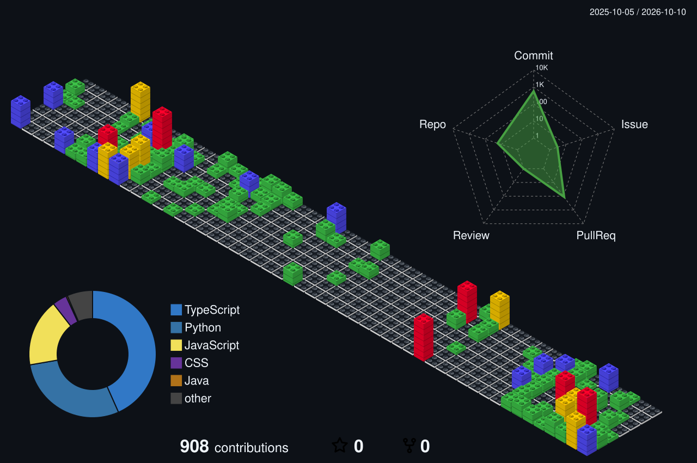

  

<h1 align="center">Hi there, I'm Santhosh!</h1>

<h2 align="center">
  
</h2>

  Software Developer • Backend • Cloud • DevOps • AI Research

  I love building software that solves real-world problems and exploring
  the intersection of backend systems, cloud infrastructure, and AI.

---

### 🚀 What I'm Working On

- 🔭 **MindFlow-AI** — An AI tool that generates mindmaps.
- 🧠 Exploring **AI, Machine Learning and Research**
- ☁️ Building with **AWS, Docker and Kubernetes**
- ⚙️ Interested in **Backend Systems, Cloud and DevOps**

---

### 🛠️ Languages & Tools

&nbsp;

&nbsp;

&nbsp;

&nbsp;

&nbsp;

&nbsp;

&nbsp;

&nbsp;

---

<h2 align="center">📊 GitHub Contributions</h2>

  

---

### 📫 Connect With Me

