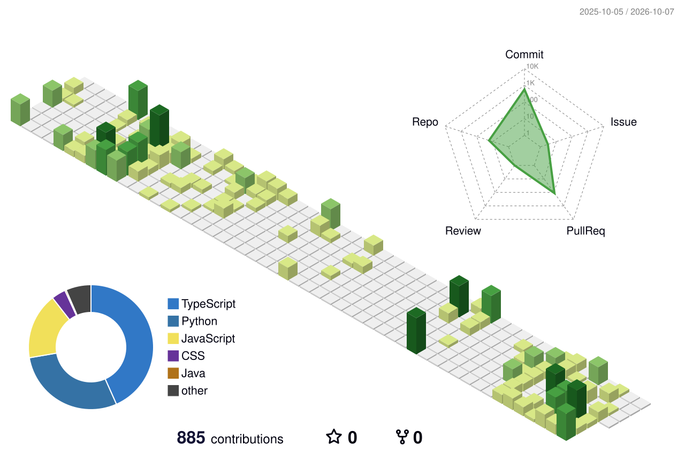

  

# Hi there, I'm Santhosh!

<h1 align="center">
  
</h1>

I'm a passionate **Software Developer** from India. I love building software that solves real-world problems.

- 🔭 I’m currently working on MindFlow-AI -- An AI tool that generates mindmaps.
- 📫 How to reach me: kunamsanthosh992@gmail.com or have a look on <a href="https://kunamsanthosh.dpdns.org">Portfolio</a>

### 🛠️ Languages and Tools

  
  
  
  
  
  
  
  
  

<h2 align="center">📊 GitHub Contributions</h2>

  

### 🔗 Connect with me

  

